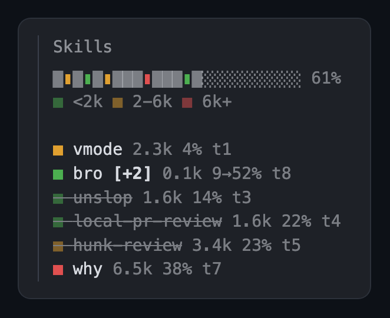

# skill-map



<sub>Drawn by the mod from sample data.</sub>

A side pane listing every skill loaded into the main conversation, one line each:

```
■ vmode [+1] 2.3k 4→61% t1
```

- The square's color is the skill's size: green under 2k tokens, amber 2k to 6k, red 6k and up. Tokens are estimated as characters / 4.
- `[+1]` counts loads that added the skill's text again. Typing `/name` twice does that. Claude Code skips a repeat Skill tool load by itself, so those don't count.
- `4→61%` is how full the context window was at the first and the latest load. `t1` is the turn of the latest load.
- After a compaction, a skill whose text was summarized away turns grey and crossed out.
- The bar on top is the context window, filled to current usage, with a marker where each skill landed.

`/skill-map` opens or closes the pane. `/skill-map reset` clears it. The pane opens by itself on the first skill load; in a terminal that only happens at 144 columns or wider, while `/skill-map` works at any width. It asks for 30 columns, about 220px.

Only the main conversation counts. Skills a subagent loads stay in the subagent's context and are left out.

## Install

```bash
claude plugin marketplace add vuon9/cc-mods
claude plugin install skill-map@cc-mods
```

Update with `claude plugin update skill-map`.

## Limits

- Skill loads are spotted by the line `Base directory for this skill: ...` that Claude Code puts at the top of each one. If a release rewords it, the pane stops picking skills up.
- Reading a `SKILL.md` counts only as a whole file: the Read tool without a line range, or a plain `cat`. `head`, `grep` and piped reads don't.
- Built and tested on Claude Code 2.1.288 to 2.1.292.

## Develop

From the repo root:

```bash
claude --plugin-dir plugins/skill-map
claude plugin test plugins/skill-map
```
