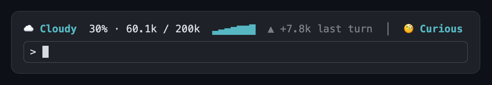

# token-weather



<sub>Drawn by the mod from sample data.</sub>

A one-line forecast of the context window, shown above the prompt and updated after every turn:

```
☁️ Cloudy  30% · 60k / 200k  ▂▃▅▆  ▲ +23.9k last turn  │  🧐️ Curious
```

- The forecast follows how full the window is: Clear under 25%, Cloudy under 50%, Showers under 75%, Storm under 90%, then Compact soon.
- The sparkline is the context size over the last 12 turns. The delta is how much the last turn added or freed.
- Right after a compaction it shows `↺ Compacted` until your next message brings back a real size.
- The mood at the end is a guess at how the session is going for you: Upbeat, Curious, Neutral, Confused or Frustrated.

Only the main conversation counts; subagent turns don't move it.

## The mood reading costs a model call

After each turn the mod sends your last 6 prompts (600 characters each) and the assistant's last reply (800 characters) to Haiku and asks for one word. That is one small request per turn, billed like any other, and it sends that text to the model. If you don't want that, don't install this mod.

## Install

```bash
claude plugin marketplace add vuon9/cc-mods
claude plugin install token-weather@cc-mods
```

Update with `claude plugin update token-weather`.

## Develop

From the repo root:

```bash
claude --plugin-dir plugins/token-weather
claude plugin test plugins/token-weather
```
